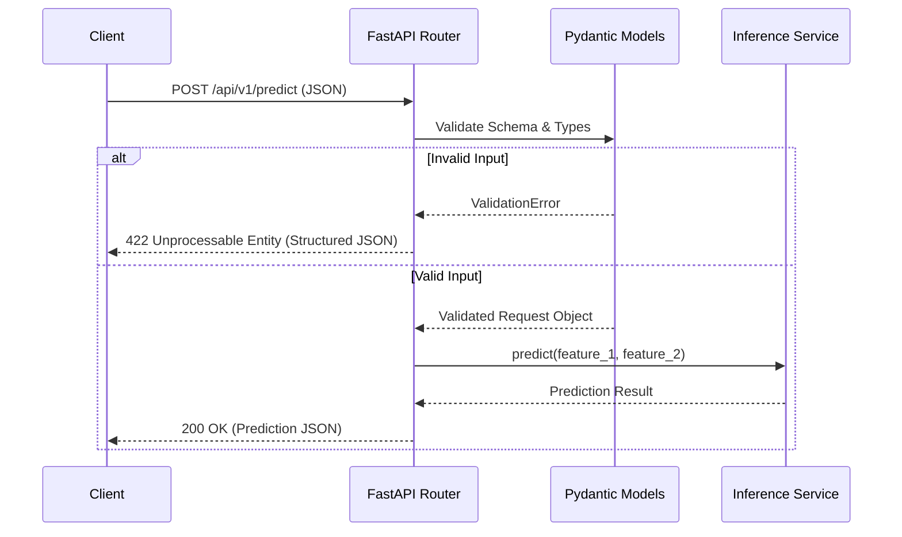

# Architecture

The system utilizes FastAPI for route handling and Pydantic for strict serialization and validation. The inference layer is decoupled from the routing logic.

## System Flow

## Key Invariants

1. **Strict Input Boundary:** Pydantic is utilized to ensure that the data shape and values are entirely validated before being passed to `InferenceService`.
2. **Safe Error Handling:** Overridden exception handlers capture backend faults and return controlled error structures to the user, ensuring security and consistency.