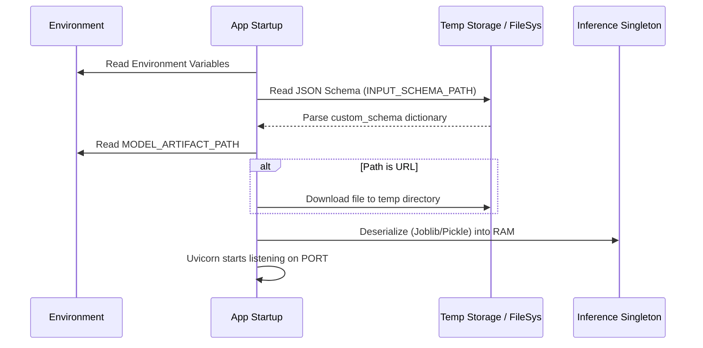
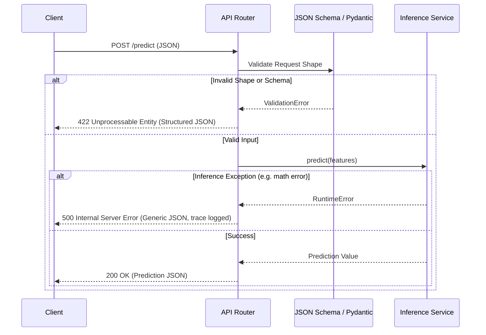

# Architecture & System Design

ModelGate decouples the API routing logic from the inference and validation engines. This separation of concerns ensures the system remains scalable, secure, and easy to test.

## 1. Startup Lifecycle

Because ModelGate supports dynamic URLs and custom schemas, it performs a strict initialization sequence before accepting traffic. It downloads the required artifact and parses the schema into memory.

## 2. Request Flow & Error Shielding

"Error Shielding" is a core tenet of this architecture. In many basic Flask/FastAPI deployments, validation errors or model crashes return a `500` error accompanied by a raw Python stack trace. This is a severe security and DX (Developer Experience) flaw. 

ModelGate overrides FastAPI's default handlers to ensure complete shielding.

## 3. The Inference Singleton

To avoid the massive latency penalty of loading a 100MB+ ML model from disk on every HTTP request, `src/services/inference.py` implements the Singleton pattern. The model is instantiated in RAM exactly once when the worker starts, and the `predict()` method simply calls the in-memory array operations.